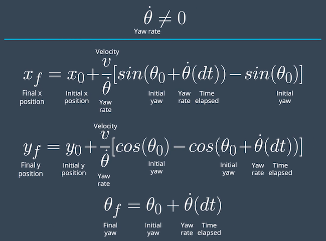

# Localization with Particle Filters

[](http://www.udacity.com/drive)

This repository contains all the code needed to complete the final project for the Localization course in Udacity's Self-Driving Car Nanodegree.


## Kidnapped Robot Problem

In robotic world, it is common to face the situation where the autonomous robot in operation being placed in an unknown location, generally refer to a classical [Kidnapped robot problem](https://en.wikipedia.org/wiki/Kidnapped_robot_problem).

Localization algorithm such as particle filters can help to localize the robot given a map and some GPS signals. The effectiveness of the localization algorithm can be assessed by testing the robot's ability to recover from catastraphic loalization failures.

## Project Overview

In this project a 2 dimensional particle filter in C++ is implemented. Your particle filter will be given a map and some initial localization information (analogous to what a GPS would provide). At each time step the filter will also get observation and control data.

## Particle Filters Implementation Steps


### 1. Initialize the particle filter (one time only)

Initalize the particle filter initial location with GPS sensor measurement noise

### 2. Predict each of the particle location

Add Gaussian noises to each particle, using the motion (bicycle) model to calculate/predict the next position of the particles based on the current position of the particles, time elapsed since last measurements, velocity and yaw rate.




### 3. Transform, Associate and update each of the particle weight


Update the particle weight by first calculating the multi-variate Gaussian probability, which requires the transformed observation of the particle and its nearst landmark. So, for each particle, we calculate the distance between each particle and landmark. If the distance is within the sensor range, then we transform observation from car to map coordinates, calculate and store the results of the distance to each landmark.

Each of the transformed observations and its closest landmarks are feed into the multi-variate Gaussian probability formula to calculate the probability. These multi-variate Gaussian probabilities are then combined by multiplying and become the particle weight.

### 4. Resample the particles

Once all the weights of particles are obtained, we then randomly re-sample the particles from a weighted particle distribution, so the particle with heavy weight (higher certainty to the landmarks) are retained for the next localization iteration, hence improving the localization performance.

### 5. Repeat steps 2 to 4

## Number of particle selection: Accuracy vs Execution time

The selection of the particle filter size (number of particles) depends on the requirement of accuracy and the maximum execution time allowed to localize the robot.

Due to the nature of the particle filter algorithm, a large number of particles tends to produce better approximation of the localzation than a small number of parciles, this however will be at the expense of longer compuatation time. 

Generally the localization accuracy improves as the number of particles increases until a threshold is reachere, where the accuracy no longer improves with increasing the particle filter size. The optimum size of the particle filters can be found via experimentation by exploring different particle filter sizes. 

| Number of Particles 	| time [s] 	| x accuracy 	| y accuracy  	| theta accuracy 	|
|:-------------------:	|:--------:	|:----------:	|:-----------:	|:--------------:	|
|          10         	|   74.22  	|    .163    	|     .135    	|      .005      	|
|          50         	|   78.12  	|    .120    	|     .112    	|      .004      	|
|       -->100         	|   84.82  	|    .111    	|     .104    	|      .004      	|
|         150         	|   85.72  	|    .112    	|     .106    	|      .004      	|
|         300         	|   81.84  	|    .110    	|     .102    	|      .004      	|
|         600         	|   91.62  	|    .109    	|     .100    	|      .004      	|


## Running the Code
This project involves the Udacity's Term 2 Simulator which can be downloaded [here](https://github.com/udacity/self-driving-car-sim/releases)

This repository includes two files that can be used to set up and install uWebSocketIO for either Linux or Mac systems. For windows you can use either Docker, VMware, or even Windows 10 Bash on Ubuntu to install uWebSocketIO.

Once the install for uWebSocketIO is complete, the main program can be built and ran by doing the following from the project top directory.

1. mkdir build
2. cd build
3. cmake ..
4. make
5. ./particle_filter

Alternatively some scripts have been included to streamline this process, these can be leveraged by executing the following in the top directory of the project:

1. ./clean.sh
2. ./build.sh
3. ./run.sh


## Inputs to the Particle Filter
The inputs to the particle filter can be found in the `data` directory.

#### The Map*
`map_data.txt` includes the position of landmarks (in meters) on an arbitrary Cartesian coordinate system. Each row has three columns
1. x position
2. y position
3. landmark id


## Success Criteria
The implemented 2D particle filter have met the following requirements:

1. **Accuracy**: your particle filter should localize vehicle position and yaw to within the values specified in the parameters `max_translation_error` and `max_yaw_error` in `src/main.cpp`.

2. **Performance**: your particle filter should complete execution within the time of 100 seconds.

and is confirmed by the simulator output ```Success! Your particle filter passed!```
